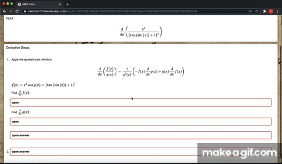

# Calc-Tutor
"Calculus Tutor" that helps you find derivatives and indefinite integrals through a step-by-step process with and A.I. powered chat bot that gives you information about key concepts in calculus.



## Getting Started

Setup project environment with [virtualenv](https://virtualenv.pypa.io) and [pip](https://pip.pypa.io).

```bash
$ virtualenv env
$ source env/bin/activate
$ pip install -r requirements.txt


$ cd calctutor123
$ python manage.py runserver
```
